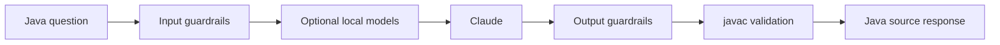

# Java Code Agent

Secure, focused Streamlit assistant that accepts Java programming questions and returns Java source code validated by local guardrails and, by default, `javac`.

## What it does



The application:

- rejects unrelated, unsafe, oversized, and prompt-injection requests before calling Claude;
- asks Claude for small, complete Java source without explanations;
- prefers complete, simple examples and avoids unnecessary complexity;
- removes accidental outer Markdown fences and rejects prose or mixed-language output;
- checks Java structure and blocks selected process-control APIs;
- compiles generated code with Java 17 by default;
- allows complete responses up to configurable generation and repair token budgets;
- makes one repair attempt when a generated response fails a retryable validation check;
- logs operational diagnostics without storing API keys or full prompts;
- shows locally tokenized input and output counts without displaying API cost;
- reuses the Anthropic client across Streamlit reruns;
- starts tokenizer, client, and enabled local-guardrail warm-up in the background when Streamlit starts.

Generated code is validated but never executed.

## Requirements

- Python 3.10 or newer
- JDK 17 or newer with `javac` on `PATH`, or a configured `JAVAC_PATH`
- Anthropic API key
- Windows PowerShell, macOS/Linux shell, or an equivalent Python environment

## Installation

### 1. Create and activate a virtual environment

```powershell
python -m venv .venv
.\.venv\Scripts\Activate.ps1
pip install -r requirements.txt
Copy-Item .env.example .env
```

On macOS/Linux:

```bash
python3 -m venv .venv
source .venv/bin/activate
pip install -r requirements.txt
cp .env.example .env
```

### 2. Configure the Anthropic key

Edit `.env` and set `ANTHROPIC_API_KEY`.

### 3. Configure Java compilation

The default is strict compiler validation:

```env
REQUIRE_JAVAC=true
JAVA_RELEASE=17
```

Check whether Java is already available:

```powershell
javac -version
```

If `javac` is installed but not on `PATH`, set its full path in `.env` without needing administrator access:

```env
JAVAC_PATH=C:\path\to\jdk-17\bin\javac.exe
```

If you cannot install a JDK because you do not have administrator access, use an existing JDK supplied by your organization, IDE, or mentor, provided its folder is accessible to your account. Ask for the full path to `javac.exe` and set `JAVAC_PATH`.

For local experimentation only, you can run without a compiler:

```env
REQUIRE_JAVAC=false
```

In this mode the application performs structural validation only and should not be treated as production-like Java verification.

### 4. Start the app

```powershell
streamlit run app.py
```

The compiler scratch directory configured by `JAVA_GUARDRAIL_TEMP_DIR` is created automatically. Relative paths are resolved from the project directory.

The application starts a non-blocking warm-up thread for the tokenizer, Anthropic client, and enabled local guardrail models. It does not make an API request. If a local model is still loading when the first prompt is submitted, that prompt may still wait for the model to finish loading.

## Configuration

The main settings are defined in `.env.example`:

| Variable | Default | Description |
|---|---|---|
| `ANTHROPIC_API_KEY` | none | Anthropic credential required for generation |
| `ANTHROPIC_MODEL` | `claude-sonnet-4-6` | Claude model used for generation |
| `JAVA_RELEASE` | `17` | Java release passed to `javac` |
| `REQUIRE_JAVAC` | `true` | Reject output when compiler validation is unavailable |
| `JAVAC_PATH` | none | Optional explicit path to `javac` |
| `JAVA_GUARDRAIL_TEMP_DIR` | system temp | Temporary compiler workspace |
| `TOKENIZER_ENCODING` | `o200k_base` | `tiktoken` encoding used for system, input, and output counters |
| `MAX_GENERATION_TOKENS` | `4096` | Maximum output tokens for the first generation request |
| `MAX_REPAIR_TOKENS` | `4096` | Maximum output tokens for a repair request |
| `ENABLE_LOCAL_MODEL_GUARDRAILS` | `false` | Enable local semantic and injection classifiers |
| `REQUIRE_LOCAL_MODEL_GUARDRAILS` | `true` | Fail closed if enabled local models cannot load |

Set `REQUIRE_JAVAC=false` only for local experimentation without a JDK. In that mode the app falls back to structural validation and should not be treated as production-like validation.

The sidebar displays only the system-prompt, latest user-prompt, and response token counts. Tokenization uses `tiktoken` and defaults to `o200k_base`; set `TOKENIZER_ENCODING` in `.env` to change the encoding. These are local tokenizer counts, not provider billing totals. No API-cost estimate is displayed.

## Tests

Run the guardrail unit tests:

```powershell
python -m pytest -q
```

The test module disables the compiler requirement so the deterministic checks can run without a JDK. Keep `REQUIRE_JAVAC=true` when testing the full application behavior.

## Runtime artifacts

- `agent.log` — rotating structured diagnostics for rejected inputs, API errors, compiler failures, repair attempts, and successful requests.
- `latency_metrics.json` — latest timings for input guardrails, local models, Claude, output validation, repair, and compilation.
- `.java_guardrail_*` — temporary compiler folders that are cleaned up after validation.

## Repository structure

```text
javaagentcodex/
├── architecture/
│   ├── design.md       # Current implementation and operational design
│   └── proposal.md     # Goals, scope, workflow, and future direction
├── app.py              # Streamlit UI and end-to-end request pipeline
├── local_guardrails.py # Optional local model checks
├── test_guardrails.py  # Guardrail tests
├── .env.example        # Configuration template
├── requirements.txt
├── CHANGELOG.md
├── HANDOFF.md
└── README.md
```

## Documentation

- [Architecture proposal](architecture/proposal.md)
- [Architecture design](architecture/design.md)
- [Project handoff](HANDOFF.md)
- [Changelog](CHANGELOG.md)
