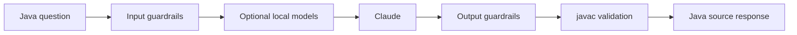

# Java Code Agent

Secure, focused Streamlit assistant that accepts Java programming questions and returns Java source code validated by local guardrails and, by default, `javac`.

## What it does



The application:

- rejects unrelated, unsafe, oversized, and prompt-injection requests before calling Claude;
- asks Claude for small, complete Java source without explanations;
- removes accidental outer Markdown fences and rejects prose or mixed-language output;
- checks Java structure and blocks selected process-control APIs;
- compiles generated code with Java 17 by default;
- makes one repair attempt when a generated response fails a retryable validation check;
- logs operational diagnostics without storing API keys or full prompts.

Generated code is validated but never executed.

## Requirements

- Python 3.10 or newer
- JDK 17 or newer with `javac` on `PATH`
- Anthropic API key
- Windows PowerShell, macOS/Linux shell, or an equivalent Python environment

## Run locally

```powershell
python -m venv .venv
.\.venv\Scripts\Activate.ps1
pip install -r requirements.txt
Copy-Item .env.example .env
```

Edit `.env` and set `ANTHROPIC_API_KEY`, then start the app:

```powershell
streamlit run app.py
```

For macOS/Linux, activate the environment with `source .venv/bin/activate` and copy the environment file with `cp .env.example .env`.

## Configuration

The main settings are defined in `.env.example`:

| Variable | Default | Description |
|---|---|---|
| `ANTHROPIC_API_KEY` | none | Anthropic credential required for generation |
| `ANTHROPIC_MODEL` | `claude-sonnet-4-6` | Claude model used for generation |
| `JAVA_RELEASE` | `17` | Java release passed to `javac` |
| `REQUIRE_JAVAC` | `true` | Reject output when compiler validation is unavailable |
| `JAVAC_PATH` | none | Optional explicit path to `javac` |
| `JAVA_GUARDRAIL_TEMP_DIR` | system temp | Temporary compiler workspace |
| `ENABLE_LOCAL_MODEL_GUARDRAILS` | `false` | Enable local semantic and injection classifiers |
| `REQUIRE_LOCAL_MODEL_GUARDRAILS` | `true` | Fail closed if enabled local models cannot load |

Set `REQUIRE_JAVAC=false` only for local experimentation without a JDK. In that mode the app falls back to structural validation and should not be treated as production-like validation.

## Tests

Run the guardrail unit tests:

```powershell
python -m pytest -q
```

The test module disables the compiler requirement so the deterministic checks can run without a JDK. Keep `REQUIRE_JAVAC=true` when testing the full application behavior.

## Runtime artifacts

- `agent.log` — rotating structured diagnostics for rejected inputs, API errors, compiler failures, repair attempts, and successful requests.
- `latency_metrics.json` — latest timings for input guardrails, local models, Claude, output validation, repair, and compilation.
- `.java_guardrail_*` — temporary compiler folders that are cleaned up after validation.

## Repository structure

```text
javaagentcodex/
├── architecture/
│   ├── design.md       # Current implementation and operational design
│   └── proposal.md     # Goals, scope, workflow, and future direction
├── app.py              # Streamlit UI and end-to-end request pipeline
├── local_guardrails.py # Optional local model checks
├── test_guardrails.py  # Guardrail tests
├── .env.example        # Configuration template
├── requirements.txt
├── CHANGELOG.md
├── HANDOFF.md
└── README.md
```

## Documentation

- [Architecture proposal](architecture/proposal.md)
- [Architecture design](architecture/design.md)
- [Project handoff](HANDOFF.md)
- [Changelog](CHANGELOG.md)
