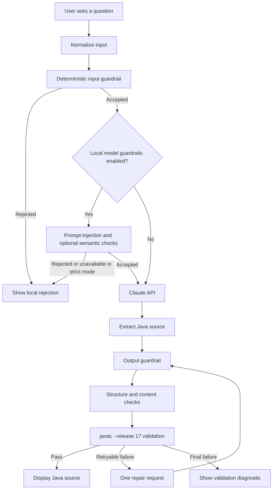

# Proposal: Java Code Agent

## 1. Summary

Java Code Agent is a Streamlit-based coding assistant for focused Java programming questions. It uses Claude to generate Java source code, while local guardrails control what enters and leaves the model boundary.

The proposed system prioritizes predictable behavior over open-ended chat:

- accept Java-related programming requests;
- reject unrelated, unsafe, oversized, or prompt-injection requests before an API call;
- generate source code only through a constrained Claude prompt;
- validate the returned source structurally and, by default, with `javac`;
- make one repair attempt only when the generated response fails a retryable validation check.

## 2. Problem statement

General-purpose coding assistants can return explanations, mixed-language snippets, or code that does not compile. They may also spend API tokens processing requests that are outside the intended Java scope.

This project addresses those risks with a narrow request contract and a fail-closed validation pipeline. The application is intended for small, self-contained Java examples rather than unrestricted software generation or production code execution.

## 3. Goals

- Provide a simple browser-based Java coding assistant.
- Keep obvious invalid or unsafe requests local and inexpensive to reject.
- Return Java source code rather than explanatory prose.
- Require Java 17-compatible compilation by default.
- Preserve useful diagnostics without logging API keys, full prompts, or generated source.
- Record request-stage latency for operational analysis.
- Support stronger local semantic and prompt-injection checks when configured.

## 4. Non-goals

- Executing generated Java code.
- Accepting arbitrary programming languages.
- Building a general-purpose conversational assistant.
- Guaranteeing that generated code is secure for production deployment.
- Replacing code review, tests, dependency scanning, or runtime sandboxing.
- Treating heuristic guardrails or local classifiers as a complete security boundary.

## 5. Proposed workflow

## 6. Security and safety strategy

The input path rejects empty or oversized requests, obvious non-Java requests, prompt-injection patterns, unsafe credential-theft/malware requests, and unsupported control characters. The output path removes a complete Markdown fence, rejects prose and non-Java fragments, checks delimiters, blocks selected process-control APIs, and compiles the source in a temporary directory.

The application never executes the generated class. Compiler scratch files are cleaned up after validation. Local model guardrails are optional at the architecture level but can be made mandatory with `REQUIRE_LOCAL_MODEL_GUARDRAILS=true`; if required models are unavailable, the request fails closed.

## 7. Expected outcome

The project should provide a small, reproducible Java assistant with a clear operational contract: accepted requests are Java-focused, successful responses are source-oriented, and the default path requires compiler acceptance before display.

## 8. Future improvements

- Add structured request and response identifiers for tracing.
- Add a dedicated test matrix for configuration combinations.
- Add rate limiting and authentication before shared deployment.
- Add stronger Java policy checks using an allowlist of permitted APIs.
- Add a sandboxed compile service if generated code must be executed in a future product.
- Separate UI, orchestration, guardrails, and provider integration into modules as the codebase grows.
